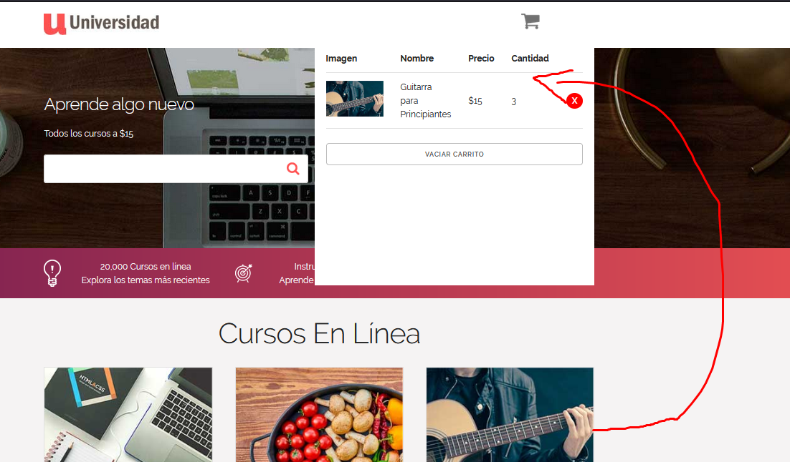

# Introducción

Lo primero que haremos es que tenemos un icono de un carrito en el menú de navegación de la aplicación cuando pasamos el mouse sobre ese icono se nos despliega una modal o un submenú que al principio estará vació y por lo tanto solo tendrá el color de fondo. Abajo del menú de navegación tendremos el cuerpo de la página en este habrá diferentes tarjetas con la información acerca de un curso en dentro de esa tarjeta habrá un botón que activa un evento para poder pasar la información de ese tarjeta al carrito de comprar de está forma estaríamos agregando ese elemento que es la tarjeta al carrito.

Estamos agregando elementos del cuerpo de la página al carrito que está en el menú entonces también debe de ser capaz de eliminar dicho elemento del carrito para eliminar esos elementos del DOM. Eso lo haces cuando presionamos en el boton con forma de "x" que cada agregado elemento tiene a la par cuando se hace clic en ese boton va a disparar un evento que lo hace es eliminar de ese arreglo de elementos el elemento seleccionado y después actualizar la interfaz de usuario para que automaticamente ya no siga el elemento agregado de forma visible.

Otra función es que si queremos eliminar todos los elementos agrega al carrito abajo de todo hay un botón que dice vaciar carrito este boton cuando se hace clic en él lo que hará es eliminar todos los elementos agregados como su nombre lo dice selecciona todos los elementos y los elimina del arreglo después actualiza la interfaz de usuario para que no haya ninguna información en el carrito de compras.

# Iniciando el proyecto

Lo primero que hacemos es seleccionar los elementos del DOM que conforman la sección del carrito de compras si nos fijamos en el archivo HTML en el menú de navegación hay como un logo entonces cuando ponemos el mouse encima de ese logo se activa una modal entonces seleccionamos todos los elementos que hay dentro de ese modal mediante la propiedad  `queryselector`
Después vamos a seleccionar el elemento contenedor que almacenas las tarjetas de los cursos.

## Creando función para agregar el evento

Ahora vamos a crear una función llamada `cargarEventListeners()` está función lo que hace es agregarle o asignarle eventos a los elementos seleccionados en este caso seleccionamos el contenedor de los cursos y utilizando el efecto burbuja si un elemento hijo activa el evento clic entonces ejecutar la función `agregarCurso` es decir si se hace clic en uno de los elemento hijo del contenedor `listaCursos`  entonces activa el evento y ejecuta la función `agregarCurso` dicha función más adelante fue creada. Si dentro del contenedor carrito se hace clic en en uno de los elementos hijos del contenedor entonces ejecuta la función `eliminarCurso` y si se hace clic  en el elemento `vaciarCarritoBtn` entonces ejecuta la función `vaciarCarrito`. Está función `cargarEventListeners()` es la primera función que se ejecuta cuando se cargar la aplicación en el navegador.

# Creando las funciones del evento

Establecimos que cada vez que se activara el evento clic en los elementos seleccionado estos automáticamente va a ejecutar una función asociada pues vamos a crear dichas funciones.

## Función que añade el curso al carrito

Está función lo que hace es agregar la tarjeta o elemento seleccionado al carrito o al contenedor carrito pues este elemento a agregar tiene como contenido más elementos. Primero vamos a desactivar el evento por defecto en este caso como el botón es un enlace entonces su evento por defecto es abrir o redirigirnos a la ubicación que tiene en el atributo `href` entonces desactivamos eso para que no haga naa ahora vamos a comprobar si el evento clic fue activado por el elemento con clase `agregar-carrito` recordemos que asignamos el evento clic al elemento contenedor `listaCursos` entonces si hicieramos clic en cualquier elemento hijo de ese contenedor activaria el evento pero nosotros no queremos eso sino que definimos que solo haciendo clic en el elemento hijo con clase `agregar-carrito` puede ejecutar la función agregarCurso si eso es así entonces detectamos cuál es el elemento abuelo de ese elemento hijo con la propiedad  `e.target.parentElement.parentElement;`porque cuando ya sabemos cuál es elemento padre del elemento que activo el evento vemos que todavía no hemos seleccionado toda la información que queremos insertar en el contenedor carrito entonces por eso al elemento padre buscamos su siguiente ancestro y vemos que es el elemento con clase `.card` y ahí si seleccionamos toda la información que queremos insentar en el contenedor `.carrito`.

Al usar `parentElement` dos veces,  `e.target.parentElement.parentElement` se refiere al elemento abuelo del elemento que activó el evento. Ahora ejecutamos la función `leerDatosCurso(curso);` que crearemos más adelante la cuál recibe como parámetro la referencía de un elemento dentro del DOM.

## Leer datos del elemento seleccionado 

Creamos la función `leerDatosCurso(curso)` que recibe como parámetros el elemento seleccionado del DOM en este caso estás seleccionado el contenedor con clase `.card` primero creamos creamos un objeto y lo que hace es que seleccionamos cada elemento hijo que conforma la tarjeta y a esa selección la guardamos en una propieda por ejemplo cada tarjeta tiene una imagen pero no nos interesa el elemento completo solo nos interesa el valor de la propiedad src entonces solo esa parte del elemento la seleccionamos y la guardamos en la propieda imagen, además cada tarjeta tiene un titulo y una descripción, lo mismo no nos interesa como tal elemento solo nos interesa seleccionar el contenido de ese titulo y de esa descripcion también vemos que el boton tiene un atributo personalizado y nos interesa seleccionar solo el valor de ese atributo personalidad que es el id y tendrá una propiedad que va a ir contando todas las veces que se ha hecho clic en el boton de esa tarjeta.

Ahora afuera de está función `leerDatosCurso` creamos un arreglo `articulosCarrito` y dentro de la función `leerDatosCurso` utilizamos el arreglo creado para llenar el carrito con los elementos del arreglo este se  va a ir llenando conforme vayamos dando clic en el botón de las tarjetas una vez yo selecciono una tarjeta completa y guardado la información en un objeto quiero llenar ese arreglo con ese objeto creado. A continuación, se utiliza el método `some` en el arreglo `articulosCarrito` para verificar si ya existe un curso con el mismo ID en el carrito. Si ya existe, se incrementa la cantidad en 1 para ese curso específico utilizando el método `map`, y se actualiza el arreglo `articulosCarrito` con los cursos actualizados. Si el curso no existe en el carrito, se agrega al arreglo `articulosCarrito` utilizando el operador de propagación (`...`) para mantener los cursos existentes y agregar el nuevo curso al final del arreglo. Luego mandamos a llamar la función `carritoHTML` para insertar el arreglo en el DOM es decir en el contenedor carrito.

## Función para agregar los elementos del arreglo al DOM

Cuando nosotros hacemos clic en el botón de una tarjeta este ejecuta la función que es `agregarCurso` que lo que hace es que a la tarjeta seleccionada toda su información es agregada en un objeto y este objeto se agrega un arreglo si se vuelve a seleccionar la misma tarjeta  y por lo tanto está ya existe dentro del arreglo entonces no la vuelve a agregar solo aumentar el valor de la propiedad cantidad de uno en uno de la tarjeta ya existente. 

Ahora vamos crear la función para agregar o actualizar el DOM cada vez que se actualiza dicho arreglo de objetos está función se ejecuta `carritoHTML()` lo primero que se hace  ejecutar la función `vaciarCarrito()` y lo que hace es eliminar todos las tarjetas agregadas  porque se van a volver insertar todos los elementos que hay en el arreglo digamos que no se actualiza un elementos existente en el DOM sino que se elimina y se vuelve a insertar dicho elemento pero ya actualizado en este caso se elimina el arreglo insertado y se vuelve insertar pero con los elementos actualizado.

Despues iteramos el arreglo como estamos trabajando con una tabla en cada iteración creamos una nueva fila es decir creamos un elemento `tr`despues insertamos código html como contenido de esa fila porque como es un contenido con código más complejo es más rápido que estar creando elemento por elemento sino que insertamos un código que el navegador interprete como estamos iterando objetos vamos a utilizar su misma información para mostrarla como contenido definimos que el valor del atributo `src` está en la propiedad imagen del objeto iterado y el contenido de las columnas están en las propiedades del objeto. Ahora creamos un fragmento  fuera de la función para no estar haciendo muchas inserciones al DOM sino que una vez tenemos la fila creada la insertamos al fragmento y cuando se termine de iterar el arreglo entonces se inserta el fragmentos con todo su contenido al DOM que es el elemento contenedor carrito.

## Función vaciar carrito
Está función lo que hace es recorrer cada elemento hijo del elemento padre que es contenedorCarrito y elimina uno por uno dicho elemento hijo porque así se podrá sobreescribir o volver a insertar esos mismos elementos hijos pero con información actualizada.

## Función eliminar curso

Primero lo que hacemos es comprobar que elemento activo este evento clic si el elemento que lo activo contiene la clase borrar-curso entonces desactiva el evento predeterminado del elemento después obtén el valor del atributo `data-id` porque este elemento que activo este evento contiene ese atributo. 

Ahora actualiza el arreglo de tarjetas y busca dentro de ese arreglo los elementos que no contenga el mismo valor que está en la variable `cursoId` porque el elemento que tenga el mismo valor se queda fuera de dicho arreglo y ahora manda a llamar la función `carritoHTML()` para actualizar el DOM.

# Resumen

Hemos visto los siguientes temas:

 - [x] Como insertar elementos al DOM
 - [x] Como actualizar la información del DOM 
 - [x] Como eliminar elementos del DOM
 - [x] Como seleccionar elementos del DOM
 - [x] El uso de la funciones para ejecutar ciertas tareas
 - [x] Como utilizar los eventos y su método burbuja
 - [x] Como iterar un arreglo 
 - [x] El uso de los Fragmentos para no insertar en el DOM cada elemento iterado si no que hacer una sola inserción 
 - [x] Como pasar contenido en este caso la tarjeta de un elemento a otro elemento.
